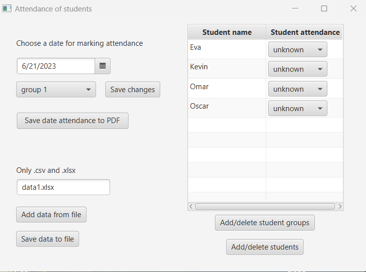

# About

An application for tracking students' attendance

## Features
* add/delete students and groups manually
* upload/update students and groups from file
* save selected date attendance to the PDF

## Technologies
#### Project is created with:

* Java 17.0.7
* Maven 3.9.3
* Javafx 19.0.2.1
	
## Setup
#### First:

* [download and install java JDK version 17 and set JAVA_HOME](https://docs.oracle.com/cd/E19182-01/821-0917/inst_jdk_javahome_t/index.html)
* clone or download the repo
* `cd ../project_directory` loacate to project directory

#### For just running the project:

* `mvnw clean javafx:run`

#### To build .jar and run the .jar file:

* `mvnw clean package` builds .jar file
* `cd ../project_dir/target` locate .jar
* `./attendance-version-shaded.jar` run the .jar

#### Things to note

* The data in files should follow the format of given example files (data1.xlsx, data2.csv)
* Date format in .csv files should be in format `MM/dd/yyyy` otherwise the program will be unable to read the dates

